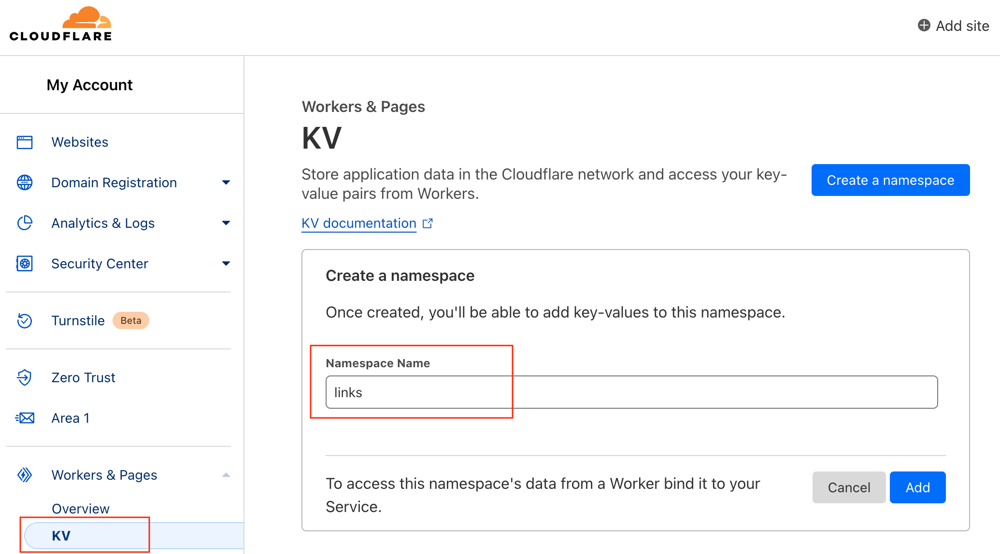

# Url-Shorten-Worker
A URL Shortener created using Cloudflare Worker

## ✨ New Features

🔒 **CAPTCHA Protection** - Integrated with [CAP Worker](https://captcha.gurl.eu.org) for bot prevention and abuse protection
- Configurable CAPTCHA on link creation and access
- Service degradation strategy for high availability
- Enterprise-grade security with graceful fallback

📚 [CAPTCHA Documentation](docs/CAPTCHA.md) | [验证码文档](docs/CAPTCHA_zh-hans.md)

# API

[API Documentation (API文档)](docs/API.md)

# Getting Start

## Quick Setup

### 1. 创建 Workers KV 命名空间 / Create KV Namespace

Go to Workers KV and create a namespace.



### 2. 绑定 KV Namespace / Bind KV Namespace

Bind an instance of a KV Namespace to access its data in a Worker.


### 3. 配置绑定 / Configure Binding

Where Variable name should set as `LINKS` and KV namespace is the namespace you just created in the first step.

Variable name 填写 `LINKS`, KV namespace 选择你刚刚创建的命名空间


### 4. 部署代码 / Deploy Code

Copy the `index.js` code from this project to Cloudflare Worker.

复制本项目中的 `index.js` 的代码到 Cloudflare Worker

### 5. 配置验证码 (可选) / Configure CAPTCHA (Optional)

Edit the `captcha` configuration in `index.js`:

```javascript
captcha: {
  enabled: true,              // Set to false to disable CAPTCHA
  require_on_create: true,    // Require CAPTCHA when creating links
  require_on_access: false,   // Require CAPTCHA when accessing links
  fallback_on_error: true,    // Allow operations when CAPTCHA service is down
}
```

**Default behavior**: CAPTCHA is required for link creation, but not for access.

**默认行为**：创建短链接需要验证码，访问短链接不需要验证码。

For detailed CAPTCHA configuration, see:
- [English Documentation](docs/CAPTCHA.md)
- [中文文档](docs/CAPTCHA_zh-hans.md)

### 6. 保存并部署 / Save and Deploy

Click Save and Deploy

# Demo
https://lnks.eu.org/

Note: Because someone abuse this demo website, all the generated link will automatically expired after 24 hours. For long-term use, please deploy your own.

注意：所有由Demo网站生成的链接24小时后会自动失效，如需长期使用请自行搭建。

# crazypeace 修改版

https://github.com/xyTom/Url-Shorten-Worker/tree/crazypeace

支持功能：1、自定义短链 2、页面缓存设置过的短链 3、长链接文本框预搜索localStorage 4、增加删除某条短链的按钮 5、密码保护
