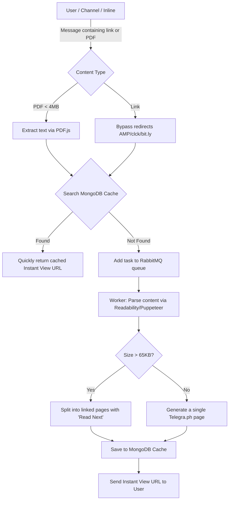

# ⚡ InstantViewBot (FormatBot)

*   [README IN RUSSIAN here ](readme_ru.md)

[](https://nodejs.org)
[](https://opensource.org/licenses/MIT)
[](https://github.com/telegraf/telegraf)
[](https://www.rabbitmq.com)
[](https://www.mongodb.com)

**InstantViewBot** is a Telegram bot for automated generation of **Instant View (IV)** pages from channel posts and messages that do not natively support this format.

You can find the bot in Telegram by keywords such as `InstantViewBot`.

The story of the bot's creation and development is described in this article (in Russian): [How I created a Telegram Bot (InstantViewBot)](https://safiullin.dev/2024/03/31/ru/kak-ya-sozdaval-bota-dlya-telegram-InstantViewBot/).

---

## ✨ Features

*   **Bypass URL Shorteners** — automatic extraction of destination URLs from redirect services (AMP, clck.ru, Yandex redirect, bit.ly, etc.).
*   **Instant View Generation (IW)** — creates a clean Instant View article using Telegra.ph or Graph.org for any full web link.
*   **PDF to Instant View Conversion** — parses sent PDF files (up to 4 MB) using `pdfjs-dist` and converts them into the Instant View format.
*   **Support for Long Articles (Multi-page Pagination)** — bypasses Telegra.ph's content limit (~65 KB per article) by automatically splitting long texts into connected pages linked via a "Read Next page" button at the bottom.
*   **Two-Level Processing Queue (RabbitMQ)** — fault-tolerant message processing using a queue broker to avoid Telegram API rate limits. Local fallback mode is supported (`NO_MQ=1`).
*   **Smart Caching in MongoDB** — duplicate link requests do not require regeneration; the result is instantly served from the database.
*   **JS Rendering (Puppeteer)** — launches a headless browser to properly parse and render dynamic content (SPAs) before converting.
*   **Inline Mode** — generate Instant View links on the fly in any chat by calling `@botusername <link>`.
*   **Admin Dashboard** — flexible runtime configuration via Telegram command line: restart the application, collect usage stats, clear cached links, and update the codebase via `git pull`.

---

## 🛠 Data Processing Architecture

Data flow diagram of a message processing task:



---

## ⚙️ Environment Variables

To run the bot, create a `.env` file based on [.env.example](file:///Users/albert/Projects/untracked/apps/node/formatbot1/.env.example). Key configuration settings:

| Variable | Description | Required |
| :--- | :--- | :--- |
| `TBTKN` | Telegram bot token from @BotFather | Yes |
| `TGADMIN` | Telegram user ID of the administrator | Yes |
| `TGGROUP` | Chat/group ID for general logs | Yes |
| `TGGROUPBUGS` | Group ID for error reporting | No |
| `TGPHTOKEN_0` | Telegraph API token (multiple keys can be specified as `_1`, `_2`, etc.) | Yes |
| `MONGO_URI` | MongoDB connection string (e.g. MongoDB Atlas) | Yes |
| `MESSAGE_QUEUE` | RabbitMQ connection string (e.g. CloudAMQP) | Yes (unless `NO_MQ` is `1`) |
| `NO_MQ` | Disable RabbitMQ (`1` — disabled, process tasks locally) | No |
| `NO_PUPPET` | Disable Puppeteer (`1` — disabled, parses via pure HTTP requests) | No |
| `DEV` | Developer mode (`1` — enables debug logs in console) | No |
| `BOT_USERNAME` | Bot username without the `@` symbol | No |
| `HELP_MESSAGE` | Custom message shown on parsing failures | No |

---

## 🔨 Commands & Control

### User Commands
*   `/start` / `/help` — Show the help message and interactive keyboard.
*   `👋 Help` — Button to show the help menu.
*   `👍Support` / `/support` — Button/command to contact support.
*   `⌨️ Hide keyboard` — Hide the interactive keyboard.

### Administrator Commands (Only available for `TGADMIN`)
| Command | Description |
| :--- | :--- |
| `/config <param> <value>` | Modify bot configuration at runtime (saved to `config.json`) |
| `/showconfig` | Show current bot settings and DB connectivity status |
| `/stat` | Output usage statistics and cache database status |
| `/last10` | Show the last 10 generated links |
| `/dbsize` | Display MongoDB database size and collection metrics |
| `/cleardb3_<link_hash>`| Delete a specific cached link using its hash/URL |
| `/toggledev` | Toggle developer log forwarding to Telegram on/off |
| `/skipcount` | Configure skipping a set number of tasks in the queue |
| `/restartapp` | Restart the bot process using PM2 |
| `/gitpull` | Execute `git pull`, update codebase, and restart the bot |
| `/getinfo` | Retrieve technical cluster information from MongoDB Atlas |

---

## 🚀 Installation & Running

### Requirements
*   Node.js version `>= 18.0.0`
*   Package manager: **Yarn** or **Bun** (the project includes `bun.lock`)
*   MongoDB and (optionally) RabbitMQ

### Getting Started

1.  **Clone the repository:**
    ```bash
    git clone https://github.com/albertincx/formatbot1.git
    cd formatbot1
    ```

2.  **Install dependencies:**
    ```bash
    yarn install
    # or using Bun:
    bun install
    ```

3.  **Configure Environment Variables:**
    Copy the template and fill in your keys:
    ```bash
    cp .env.example .env
    ```

4.  **Run in Development Mode:**
    ```bash
    yarn dev
    ```

5.  **Run in Production:**
    It is recommended to run the app using [PM2](https://pm2.keymetrics.io/) using the provided ecosystem config:
    ```bash
    pm2 start ecosystem.config.js
    ```

---

## 📖 Useful Links

*   [How to Run (Deployment Guide in Wiki)](https://github.com/albertincx/formatbot1/wiki/How-to-RUN)
*   [Blog post on Safiullin.dev (Russian)](https://safiullin.dev/2024/03/31/ru/kak-ya-sozdaval-bota-dlya-telegram-InstantViewBot/)
*   License: [MIT License](file:///Users/albert/Projects/untracked/apps/node/formatbot1/LICENSE)
