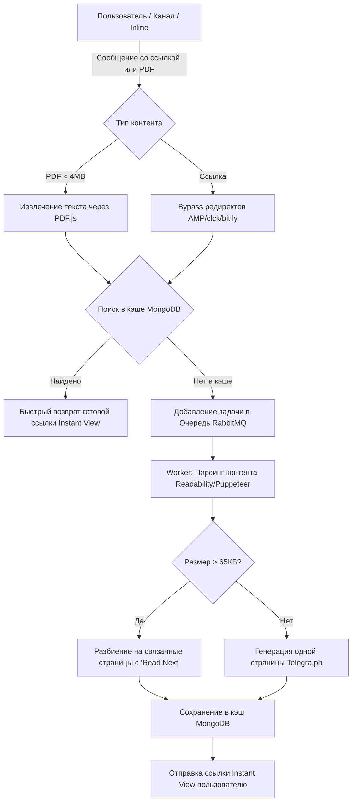

# ⚡ InstantViewBot (FormatBot)

[](https://nodejs.org)
[](https://opensource.org/licenses/MIT)
[](https://github.com/telegraf/telegraf)
[](https://www.rabbitmq.com)
[](https://www.mongodb.com)

**InstantViewBot** — это Telegram-бот для автоматической генерации страниц **Instant View (Мгновенный просмотр)** из постов каналов и сообщений, которые изначально не поддерживают этот формат.

Вы можете найти бота в Telegram по ключевым словам, например, `InstantViewBot`.

История создания и развития бота описана в статье: [Как я создавал бота для Telegram (InstantViewBot)](https://safiullin.dev/2024/03/31/ru/kak-ya-sozdaval-bota-dlya-telegram-InstantViewBot/).

---

## ✨ Возможности (Features)

*   **Раскрытие сокращенных ссылок** — автоматическое извлечение оригинальных ссылок из сервисов-сокращателей (AMP, clck.ru, Yandex redirect, bit.ly и др.).
*   **Генерация Instant View (IW)** — создание красивого мгновенного просмотра на базе Telegra.ph или Graph.org для любой полноценной веб-страницы.
*   **Конвертация PDF в Instant View** — отправленные PDF-файлы (размером до 4 МБ) парсятся с помощью `pdfjs-dist` и преобразуются в удобный Instant View формат.
*   **Поддержка длинных статей (Мультистраничность)** — обход лимита Telegra.ph (~65 КБ на статью) путем автоматического разбиения длинных материалов на взаимосвязанные страницы со ссылкой «Read Next page».
*   **Двухуровневая очередь обработки (RabbitMQ)** — отказоустойчивая обработка запросов с помощью брокера сообщений для избежания лимитов API Telegram. Поддерживается и режим локального выполнения (`NO_MQ=1`).
*   **Умное кэширование в MongoDB** — повторная отправка одной и той же ссылки не требует новой генерации, результат мгновенно берется из базы данных.
*   **Рендеринг JS (Puppeteer)** — для сайтов с динамическим контентом (SPA) бот может запустить headless-браузер для корректного парсинга.
*   **Инлайн-режим (Inline Mode)** — возможность генерировать Instant View прямо в любом чате через вызов `@имя_бота <ссылка>`.
*   **Административная панель** — гибкое управление через Telegram-команды, перезапуск приложения, сбор метрик, очистка базы и обновление бота через `git pull`.

---

## 🛠 Архитектура обработки данных

Схема жизненного цикла запроса в боте:



---

## ⚙️ Настройка окружения (Environment Variables)

Для запуска бота создайте файл `.env` на основе примера [.env.example](file:///Users/albert/Projects/untracked/apps/node/formatbot1/.env.example). Основные параметры конфигурации:

| Переменная | Описание | Обязательность |
| :--- | :--- | :--- |
| `TBTKN` | Токен Telegram-бота от @BotFather | Да |
| `TGADMIN` | ID администратора бота в Telegram | Да |
| `TGGROUP` | Чат/группа для отправки логов работы | Да |
| `TGGROUPBUGS` | Группа для логирования критических ошибок | Нет |
| `TGPHTOKEN_0` | Токен Telegraph API (можно указать несколько через `_1`, `_2` и т.д.) | Да |
| `MONGO_URI` | Строка подключения к MongoDB (например, MongoDB Atlas) | Да |
| `MESSAGE_QUEUE` | Строка подключения к RabbitMQ (например, CloudAMQP) | Да (если `NO_MQ` не равен `1`) |
| `NO_MQ` | Отключить использование RabbitMQ (`1` — выключен, обработка локально) | Нет |
| `NO_PUPPET` | Отключить Puppeteer (`1` — выключен, парсинг только через HTTP) | Нет |
| `DEV` | Режим разработчика (`1` — включено логирование в консоль) | Нет |
| `BOT_USERNAME` | Юзернейм бота без символа `@` | Нет |
| `HELP_MESSAGE` | Кастомное сообщение при ошибках | Нет |

---

## 🔨 Команды и Управление

### Пользовательские команды
*   `/start` / `/help` — Показать справочное сообщение и клавиатуру.
*   `👋 Help` — Кнопка вызова меню помощи.
*   `👍Support` / `/support` — Кнопка/команда связи с поддержкой.
*   `⌨️ Hide keyboard` — Спрятать встроенную клавиатуру.

### Административные команды (Доступны только для `TGADMIN`)
| Команда | Описание |
| :--- | :--- |
| `/config <param> <value>` | Изменить параметр конфигурации «на лету» (сохраняется в `config.json`) |
| `/showconfig` | Показать текущие настройки бота и статус базы данных |
| `/stat` | Вывести статистику использования и состояние кэша |
| `/last10` | Вывести последние 10 сгенерированных ссылок |
| `/dbsize` | Показать размер и метрики базы данных MongoDB |
| `/cleardb3_<link_hash>`| Удалить конкретную запись из кэша по хэшу/ссылке |
| `/toggledev` | Включить или выключить режим логирования разработчика в Telegram |
| `/skipcount` | Настроить пропуск определенного количества задач |
| `/restartapp` | Перезапустить бота через PM2 |
| `/gitpull` | Выполнить `git pull`, обновить код и перезапустить приложение |
| `/getinfo` | Получить техническую информацию о кластере MongoDB Atlas |

---

## 🚀 Установка и запуск

### Требования
*   Node.js версии `>= 18.0.0`
*   Пакетный менеджер **Yarn** или **Bun** (в проекте присутствует `bun.lock`)
*   MongoDB и (опционально) RabbitMQ

### Пошаговый запуск

1.  **Клонирование репозитория:**
    ```bash
    git clone https://github.com/albertincx/formatbot1.git
    cd formatbot1
    ```

2.  **Установка зависимостей:**
    ```bash
    yarn install
    # или при использовании Bun:
    bun install
    ```

3.  **Настройка переменных среды:**
    Скопируйте шаблон и заполните его своими ключами:
    ```bash
    cp .env.example .env
    ```

4.  **Запуск в режиме разработки:**
    ```bash
    yarn dev
    ```

5.  **Запуск в production:**
    Рекомендуется использовать [PM2](https://pm2.keymetrics.io/) с помощью конфигурации в проекте:
    ```bash
    pm2 start ecosystem.config.js
    ```

---

## 📖 Полезные ссылки

*   [Инструкция по развертыванию в Wiki](https://github.com/albertincx/formatbot1/wiki/How-to-RUN)
*   [Блог-пост о создании бота на Safiullin.dev](https://safiullin.dev/2024/03/31/ru/kak-ya-sozdaval-bota-dlya-telegram-InstantViewBot/)
*   Лицензия: [MIT License](file:///Users/albert/Projects/untracked/apps/node/formatbot1/LICENSE)
